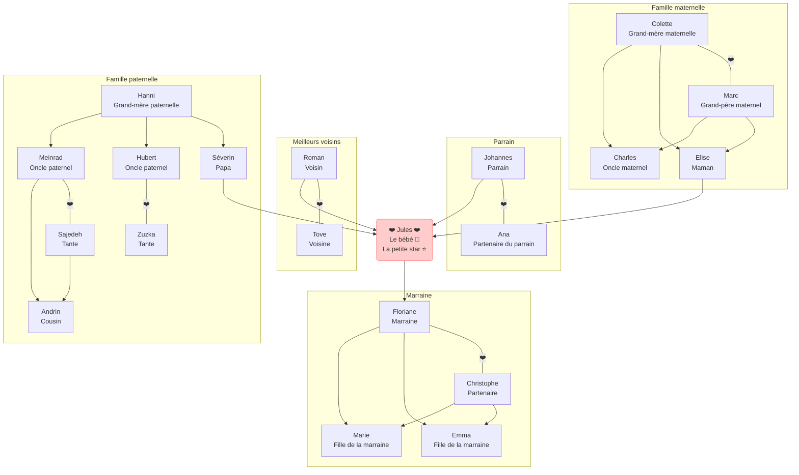

```mermaid
graph TD
    subgraph Famille_Maternelle["Famille maternelle"]
        direction TD
        Colette["Colette\nGrand-mère maternelle"] -- ❤️ --- Marc["Marc\nGrand-père maternel"]
        Elise["Elise\nMaman"]
        Charles["Charles\nOncle maternel"]
        Colette --> Elise
        Marc --> Elise
        Colette --> Charles
        Marc --> Charles
    end

    subgraph sg_Parrain["Parrain"]
        direction LR
        Johannes["Johannes\nParrain"] -- ❤️ --- Ana["Ana\nPartenaire du parrain"]
    end

    subgraph sg_Voisins["Meilleurs voisins"]
        direction LR
        Roman["Roman\nVoisin"] -- ❤️ --- Tove["Tove\nVoisine"]
    end

    Jules("❤️ Jules ❤️\nLe bébé 👶\nLa petite star ⭐")
    style Jules fill:#ffcccc,stroke:#ff6b6b,color:#333333

    subgraph sg_Marraine["Marraine"]
        direction TD
        Floriane["Floriane\nMarraine"] -- ❤️ --- Christophe["Christophe\nPartenaire"]
        Emma["Emma\nFille de la marraine"]
        Marie["Marie\nFille de la marraine"]
        Floriane --> Emma
        Floriane --> Marie
        Christophe --> Emma
        Christophe --> Marie
    end

    Elise --> Jules
    Jules --> Floriane
    Johannes --> Jules
    Roman --> Jules

    subgraph Famille_Paternelle["Famille paternelle"]
        direction TD
        Hanni["Hanni\nGrand-mère paternelle"]
        Severin["Séverin\nPapa"]
        Hubert["Hubert\nOncle paternel"] -- ❤️ --- Zuzka["Zuzka\nTante"]
        Meinrad["Meinrad\nOncle paternel"] -- ❤️ --- Sajedeh["Sajedeh\nTante"]
        Andrin["Andrin\nCousin"]
        Hanni --> Severin
        Hanni --> Hubert
        Hanni --> Meinrad
        Meinrad --> Andrin
        Sajedeh --> Andrin
    end

    Severin --> Jules
```
